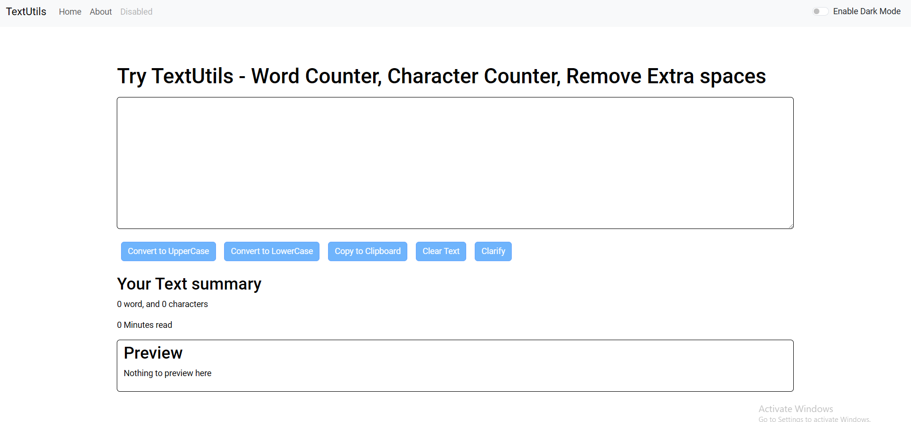
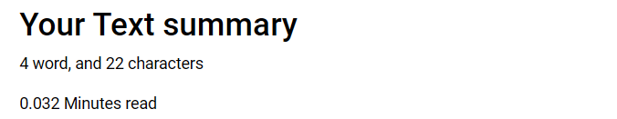
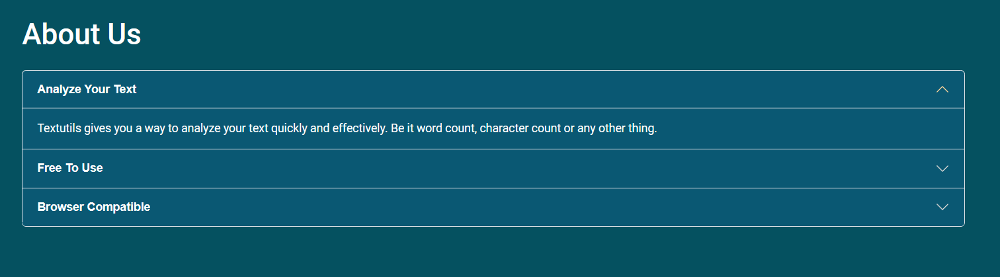
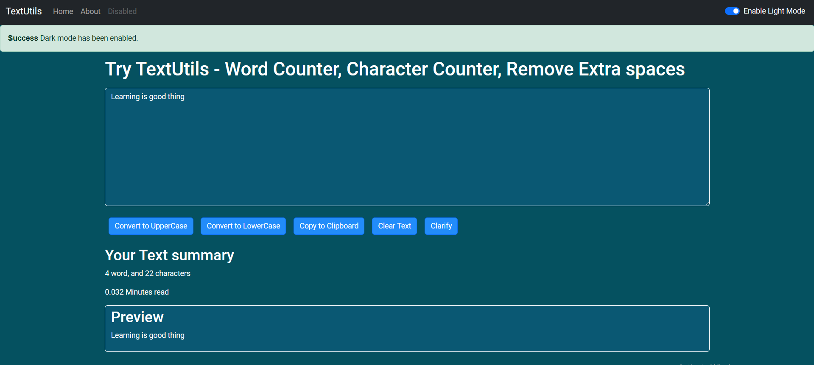

# Text Utils

## Overview

Welcome to Text Utils! This website is designed to make text manipulation and analysis simple and efficient. Whether you need to convert text to different cases, copy text, preview it, or count words, Text Utils has got you covered. With a user-friendly interface and support for both dark and light modes, it's the perfect tool for all your text-related needs.

## Features

- **To Uppercase**: Transform your text to uppercase quickly. Perfect for highlighting important content.

- **To Lowercase**: Easily convert your text to lowercase with a single click. Ideal for standardizing text.

- **Copy**: Copy the text to your clipboard effortlessly, so you can paste it wherever you need.

## Word Count

Automatically count the number of words in your text to help you keep track of content length.

## Preview

See a live preview of your text changes in real-time, ensuring you get exactly what you want.

## About Us

At Text Utils, we are dedicated to providing simple yet powerful tools to streamline your text management tasks. Our team believes in making text manipulation as straightforward as possible, so you can focus on what matters most. Thank you for using our tools, and we hope they make your work easier!

## Dark Mode / Light Mode

Our website supports both dark and light modes to ensure a comfortable reading experience. Switch between modes based on your preference or lighting conditions to reduce eye strain and enhance visibility.

;
